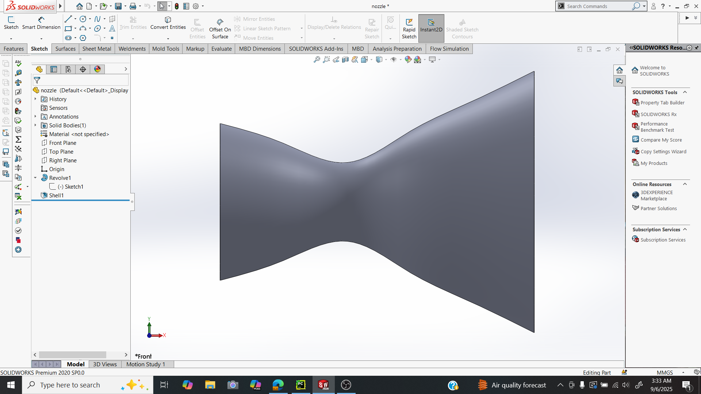
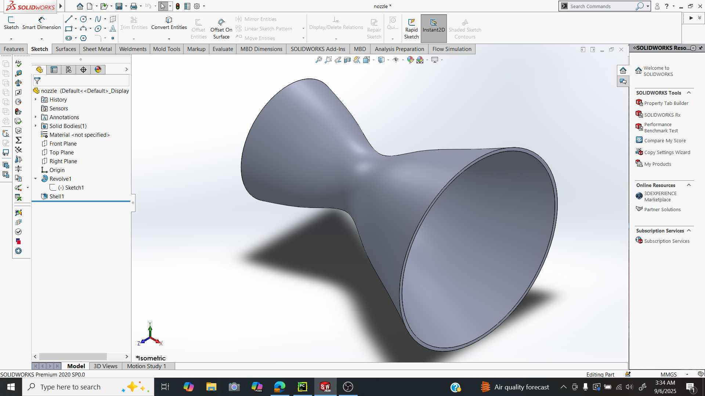
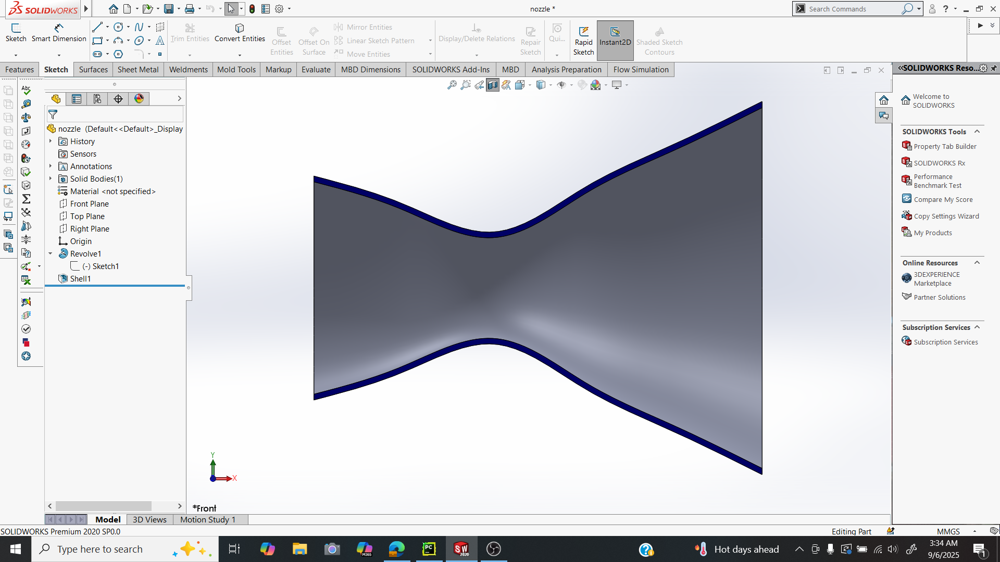
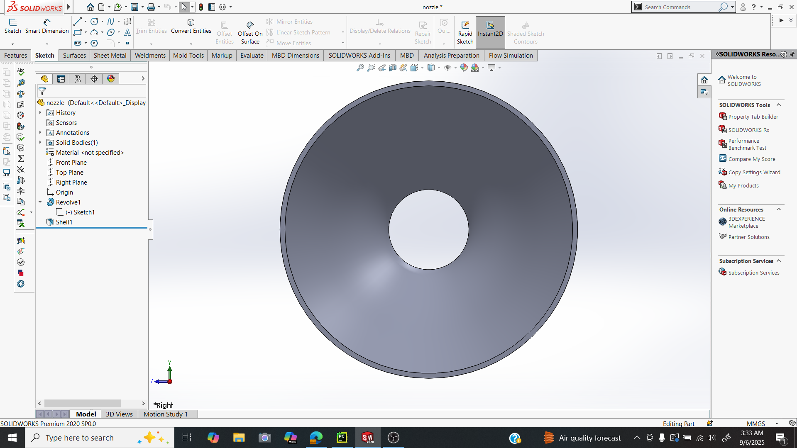

# Parametric CD Nozzle Generator (Python + SolidWorks API)

A Python-powered automation script to generate **3D convergent-divergent (CD) nozzle models** in SolidWorks based on user-defined dimensions.  
*(Note: The main automation code is private; this repository showcases the project workflow, demo, and results.)*

---

## Badges

---

## Features
- Fully automated nozzle creation in SolidWorks  
- Parametric design: input inlet diameter, throat diameter, exit diameter, length, and wall thickness  
- Educational and portfolio showcase  
- Demonstrates SolidWorks API automation workflow  
- Repeatable and smooth nozzle models

---

## Requirements
- Windows OS  
- SolidWorks 2020 or later  
- Python 3.8+  
- `pywin32` package (only if running the automation code privately)  

---

## 📸 Demo
  
*Annotated CD nozzle with inlet, throat, exit, and smooth spline shape.* 

---

## How It Works
1. User manually inputs nozzle parameters (all in mm):  
   - Inlet diameter  
   - Throat diameter  
   - Exit diameter  
   - Length  
   - Wall thickness
2. Python script (private) communicates with SolidWorks via COM API
3. The script automatically:
   - Sketches the 2D nozzle outline with spline and reference lines
   - Revolves the sketch to create 3D geometry
   - Applies shell feature to create wall thickness
4. SolidWorks displays the finished 3D nozzle

---

## Example Parameters
- Inlet diameter: 60 mm  
- Throat diameter: 30 mm  
- Exit diameter: 100 mm  
- Length: 240 mm  
- Wall thickness: 1.5 mm  

> Midpoints between inlet-throat and throat-exit are automatically calculated to create smooth nozzle profile.

---

## Usage (Private Code)
> The Python automation script is private and not included in this repository.  

To run locally (if you have access):
1. Install Python 3.8+ and `pywin32`
2. Open SolidWorks 2020+
3. Run the script and input nozzle parameters as prompted
4. Observe the automated model generation in SolidWorks

---

## Result

## Notes

COM (Component Object Model):
A Microsoft technology that allows software components to communicate and share functionality within Windows.

API (Application Programming Interface):
A set of rules and functions that lets one program use features of another program.

COM API in SolidWorks:
Enables automation by allowing Python (or other languages) to control SolidWorks: create sketches, extrude, revolve, cut, set views, and save files—all programmatically.

PyWin32:
A Python package that acts as a bridge between Python and Windows COM objects. It allows Python to control Windows applications like SolidWorks, Excel, Word, etc.

